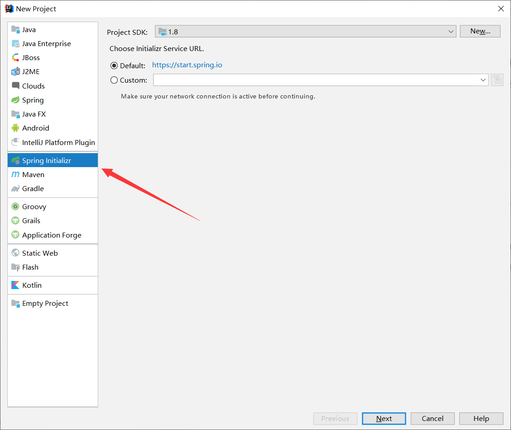
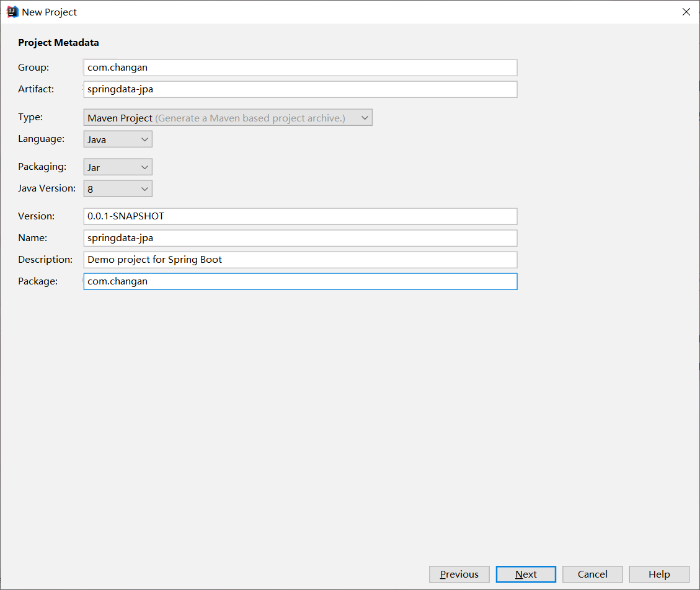
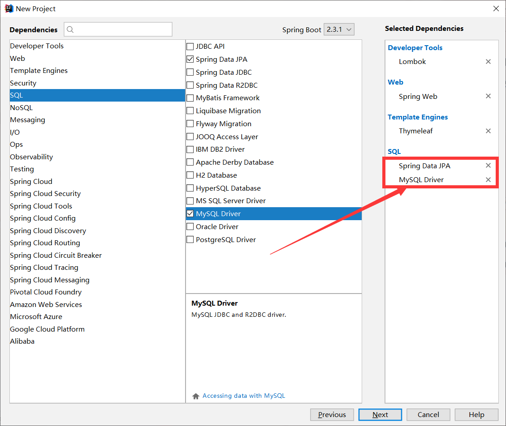
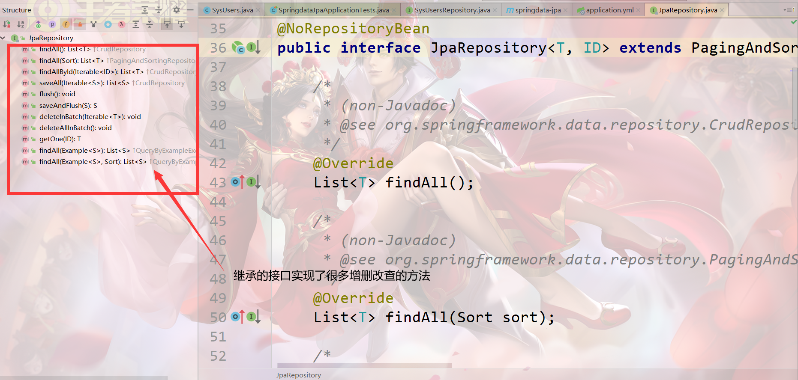
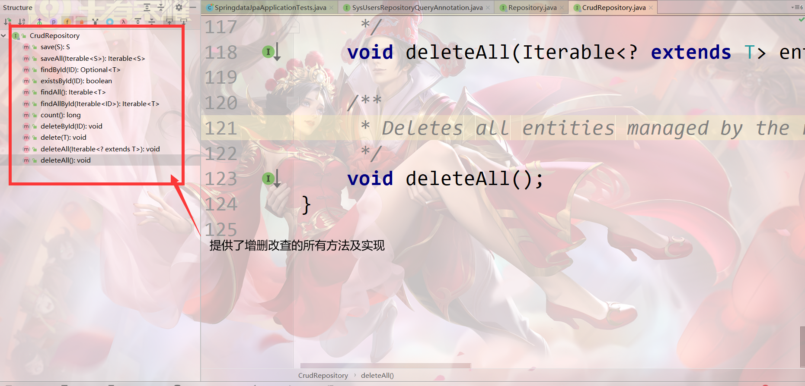
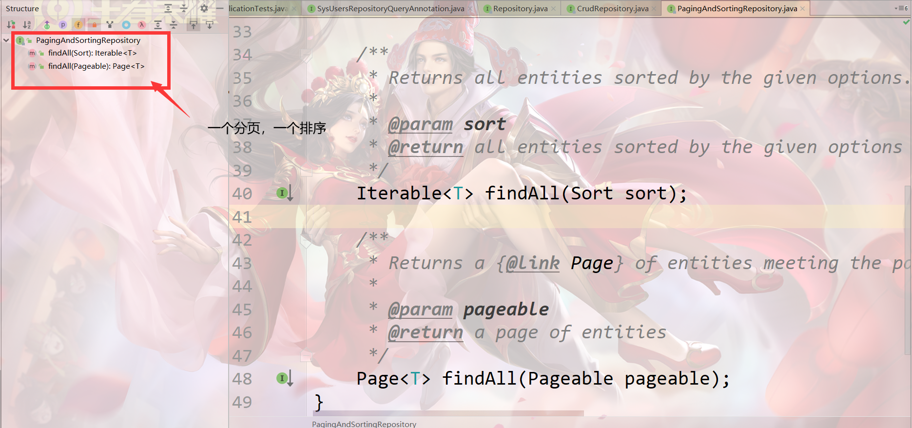

# SpringData-JPA

## 创建项目







> pom.xml

```xml
<?xml version="1.0" encoding="UTF-8"?>
<project xmlns="http://maven.apache.org/POM/4.0.0" xmlns:xsi="http://www.w3.org/2001/XMLSchema-instance"
         xsi:schemaLocation="http://maven.apache.org/POM/4.0.0 https://maven.apache.org/xsd/maven-4.0.0.xsd">
    <modelVersion>4.0.0</modelVersion>
    <parent>
        <groupId>org.springframework.boot</groupId>
        <artifactId>spring-boot-starter-parent</artifactId>
        <version>2.3.1.RELEASE</version>
        <relativePath/> <!-- lookup parent from repository -->
    </parent>
    <groupId>com.changan</groupId>
    <artifactId>springdata-jpa</artifactId>
    <version>0.0.1-SNAPSHOT</version>
    <name>springdata-jpa</name>
    <description>Demo project for Spring Boot</description>

    <properties>
        <java.version>1.8</java.version>
    </properties>

    <dependencies>
        <!--添加一个springdata-jpa的依赖-->
        <dependency>
            <groupId>org.springframework.boot</groupId>
            <artifactId>spring-boot-starter-data-jpa</artifactId>
        </dependency>
        <dependency>
            <groupId>org.springframework.boot</groupId>
            <artifactId>spring-boot-starter-web</artifactId>
        </dependency>

        <dependency>
            <groupId>mysql</groupId>
            <artifactId>mysql-connector-java</artifactId>
            <scope>runtime</scope>
        </dependency>
        <dependency>
            <groupId>org.projectlombok</groupId>
            <artifactId>lombok</artifactId>
            <optional>true</optional>
        </dependency>
        <dependency>
            <groupId>org.springframework.boot</groupId>
            <artifactId>spring-boot-starter-test</artifactId>
            <scope>test</scope>
            <exclusions>
                <exclusion>
                    <groupId>org.junit.vintage</groupId>
                    <artifactId>junit-vintage-engine</artifactId>
                </exclusion>
            </exclusions>
        </dependency>
    </dependencies>

    <build>
        <plugins>
            <plugin>
                <groupId>org.springframework.boot</groupId>
                <artifactId>spring-boot-maven-plugin</artifactId>
            </plugin>
        </plugins>
    </build>
</project>
```

> application.yml

```yaml
spring:
  application:
    name: springdata-jpa
  datasource:
    driver-class-name: com.mysql.cj.jdbc.Driver
    url: jdbc:mysql://localhost:3306/framework?useUnicode=true&characterEncoding=UTF-8&serverTimezone=UTC
    username: root
    password: root
  jpa:
    show-sql: true  #展示sql语句
    hibernate:
      ddl-auto: update  #没有则创建,有则更新  create
      naming: #驼峰命名
        physical-strategy: org.hibernate.boot.model.naming.PhysicalNamingStrategyStandardImpl
        implicit-strategy: org.hibernate.boot.model.naming.ImplicitNamingStrategyComponentPathImpl
    database: mysql
server:
  port: 8080
```

## 开发步骤

> 创建实体类(SysUsers.java)

```java
package com.changan.entity;


import lombok.Data;

import javax.persistence.*;
import java.io.Serializable;

/*
 *   name对应的数据库中表的名称 schema对应的逻辑数据库名
 *   entity和数据库的table是映射关系
 *   只要关系到网络传输的都需要序列化
 * */
@Data
@Entity
@Table(name = "sys_user")
public class SysUsers {

    /**
     * 也需要指定id的主键生成策略
     * SEQUENCE 通过Oracle的序列生成
     */
    @Id
    @GeneratedValue(strategy= GenerationType.IDENTITY)
    private Integer id;

    /**
     * @Column对应表中的列名
     */
    @Column(name = "name")
    private String name;

    private Integer age;

    private String addr;
}
```

> 创建dao层(SysUsersRepository.java)

```java
public interface SysUsersRepository extends JpaRepository<SysUsers, Integer> {
 
	/**
	 * JpaRepository<T,ID>
	 * 
	 * T:当前需要映射的实体。 ID:当前映射实体中ID的类型
	 */
}
```

> JpaRepository源码



> 启动类(SpringdataJpaApplication.java)

```java
package com.changan;

import org.springframework.boot.SpringApplication;
import org.springframework.boot.autoconfigure.SpringBootApplication;

@SpringBootApplication
public class SpringdataJpaApplication {

    public static void main(String[] args) {
        SpringApplication.run(SpringdataJpaApplication.class, args);
    }
}
```

> 测试类(SpringdataJpaApplicationTests.java)

这是接口提供的现有的方法,可以实现简单的增删改查

```java
package com.changan;

import com.changan.dao.SysUsersRepository;
import com.changan.entity.SysUsers;
import org.junit.jupiter.api.Test;
import org.springframework.beans.factory.annotation.Autowired;
import org.springframework.boot.test.context.SpringBootTest;
import org.springframework.data.domain.Example;
import org.springframework.data.domain.ExampleMatcher;
import org.springframework.transaction.annotation.Transactional;

import java.util.ArrayList;
import java.util.List;

@SpringBootTest
@Transactional
class SpringdataJpaApplicationTests {

    @Autowired
    private SysUsersRepository sysUsersRepository;

    /**
     * 增加一个
     */
    @Test
    void saveOne() {
        SysUsers sysUsers = new SysUsers();
        sysUsers.setName("ange");
        sysUsers.setAge(20);
        sysUsers.setAddr("湖南长沙");
        sysUsersRepository.save(sysUsers);
    }

    /**
     * 增加多个
     */
    @Test
    public void saveAll(){
        List<SysUsers> users = new ArrayList<>();
        SysUsers sysUsers1 = new SysUsers();
        sysUsers1.setName("li");
        sysUsers1.setAge(21);
        sysUsers1.setAddr("开福区");
        users.add(sysUsers1);

        SysUsers sysUsers2 = new SysUsers();
        sysUsers2.setName("han");
        sysUsers2.setAge(22);
        sysUsers2.setAddr("保税店");
        users.add(sysUsers2);

        long start = System.currentTimeMillis();
        sysUsersRepository.saveAll(users);
        long end = System.currentTimeMillis();

        System.out.println(end - start);
    }

    /**
     * 增加和修改共享同一个方法save,对象如果存在id则修改,没有id则添加
     */
    @Test
    public void update(){
        SysUsers sysUsers = new SysUsers();
        sysUsers.setId(1);
        sysUsers.setName("ange666");
        sysUsers.setAge(18);
        sysUsers.setAddr("湖南长沙岳麓区");
        //修改也是使用的save,如果存在主键ID就是修改,不存在则创建
        sysUsersRepository.save(sysUsers);
    }

    /**
     * 删除
     */
    @Test
    public void delete(){
        /*SysUsers sysUsers = sysUsersRepository.getOne(5);
        sysUsersRepository.delete(sysUsers);*/
        sysUsersRepository.deleteById(4);
    }

    /**
     * 查询单个
     */
    @Test
    public void selectOne(){
        SysUsers sysUsers = sysUsersRepository.getOne(3);
        System.out.println(sysUsers);
    }

    /**
     * 查询多个
     */
    @Test
    public void selectList(){
        List<SysUsers> usersList = sysUsersRepository.findAll();
        usersList.forEach(System.out::println);
    }
}
```

## Repository接口的使用

Repository接口给我们提供了两种查询方法：方法名称命名查询方式，基于@Query注解的查询与更新。

==第一种:方法名称命名查询方式==

* 编写接口

```java
public interface SysUsersRepository extends Repository<SysUsers, Integer> {
 
	/**
	 * 方法名称名称查询方式
	 * 
	 * 名称规则：方法的名称必须遵循驼峰式名称规则 : findBy(关键字) + 属性名称（首字母大写） + 查询条件（首字母大写）
	 */
 
	// 单条件
	List<SysUsers> findByName(String name);
 
	// 多条件（and）
	List<SysUsers> findByNameAndAge(String name, int age);
 
	// 多条件（or）
	List<SysUsers> findByNameOrAge(String name, int age);
 
	// 单条件（like）
	List<SysUsers> findByNameLike(String name);
}
```

* 测试代码

````java
package com.changan;

import com.changan.dao.SysUsersRepository;
import com.changan.entity.SysUsers;
import org.junit.jupiter.api.Test;
import org.springframework.beans.factory.annotation.Autowired;
import org.springframework.boot.test.context.SpringBootTest;
import org.springframework.data.domain.Example;
import org.springframework.data.domain.ExampleMatcher;
import org.springframework.transaction.annotation.Transactional;

import java.util.ArrayList;
import java.util.List;

@SpringBootTest
@Transactional
public class RepositoryTest {
 
	@Autowired
	private SysUsersRepository sysUsersRepository;
 
	/**
	 * 单条件查询测试
	 */
	@Test
	public void TestfindByName() {
		List<SysUsers> ls = this.sysUsersRepository.findByName("Lucy");
		for (SysUsers sysUsers : ls) {
			System.out.println(sysUsers);
		}
 
		List<SysUsers> ls2 = this.sysUsersRepository.findByNameLike("%Lucy%");
		for (SysUsers sysUsers : ls2) {
			System.out.println(sysUsers);
		}
	}
 
	/**
	 * 多条件查询测试
	 */
	@Test
	public void TestfindByNameAndAge() {
		List<SysUsers> ls = this.sysUsersRepository.findByNameAndAge("Lucy", 12);
		for (SysUsers sysUsers : ls) {
			System.out.println(sysUsers);
		}
 
		List<SysUsers> ls2 = this.sysUsersRepository.findByNameOrAge("Lucy", 12);
		for (SysUsers sysUsers : ls2) {
			System.out.println(sysUsers);
		}
	}
}
````

==第二种:基于@Query注解的查询与更新==

* 编写接口

```java
package com.changan.dao;

import com.changan.entity.SysUsers;
import org.springframework.data.jpa.repository.JpaRepository;
import org.springframework.data.jpa.repository.Modifying;
import org.springframework.data.jpa.repository.Query;
import org.springframework.data.repository.Repository;

import java.util.List;

public interface SysUsersRepositoryQueryAnnotation extends Repository<SysUsers, Integer> {

    // 注意点：这种写法语句中 SysUsers 必须是和实体类名称一样 不能是数据里的表名称（sys_users）
    // 底层会对HQL语句就行转换,这种方法nativeQuery默认为false 不实用原生的sql查询,而是HQL
    //1代表的时候占位符的位置
    @Query(value = "from SysUsers where name = ?1",nativeQuery = false)
    List<SysUsers> QueryByNameHQL(String name);

    // 注意点：nativeQuery= true 说明这的语句就是正常的SQL语句，底层不会对改语句进行转换
    @Query(value = "select * from sys_user where name = ?", nativeQuery = true)
    List<SysUsers> QueryByNameSQL(String name);

    @Query("update SysUsers set name = ?1 where id =?2")
    @Modifying // 需要加上@Modifying Annotation
    void UpdateSysUsersNameById(String name, Integer id);
}
```

* 编写测试类

```java
package com.changan;

import com.changan.dao.SysUsersRepositoryQueryAnnotation;
import com.changan.entity.SysUsers;
import org.junit.jupiter.api.Test;
import org.springframework.beans.factory.annotation.Autowired;
import org.springframework.boot.test.context.SpringBootTest;
import org.springframework.data.jpa.repository.Modifying;
import org.springframework.data.jpa.repository.Query;
import org.springframework.data.repository.Repository;
import org.springframework.test.annotation.Rollback;
import org.springframework.transaction.annotation.Transactional;

import java.util.List;

@SpringBootTest
class SysUsersRepositoryQueryAnnotationTest{

    @Autowired
    private SysUsersRepositoryQueryAnnotation sysUsersRepositoryQueryAnnotation;

    @Test
    void QueryByNameHQL() {
        List<SysUsers> tang = sysUsersRepositoryQueryAnnotation.QueryByNameHQL("tang");
        tang.forEach(System.out::println);
    }

    @Test
    void QueryByNameSQL() {
        List<SysUsers> tang = sysUsersRepositoryQueryAnnotation.QueryByNameSQL("tang");
        tang.forEach(System.out::println);
    }

    @Test
    // 注意: @Transactional和@Test一起用的时候事务是自动回滚的
    @Transactional
    // 所以需要加上@Rollback(false) 标识不回滚
    @Rollback(false)
    public void TestUpdateSysUsersNameById() {
        this.sysUsersRepositoryQueryAnnotation.UpdateSysUsersNameById("ange", 1);
    }
}
```

## CrudRepository接口的使用

CrudRepository接口，主要是完成一些增删改查的操作。注意：CrudRepository接口集成了Repository接口。



* 编写接口

```java
public interface SysUsersCrudRepository extends CrudRepository<SysUsers, Integer> {
    /**
	 * 先不需要写接口
	 */
}
```

* 编写测试类

```java
package com.changan;

import com.changan.dao.SysUsersCrudRepository;
import com.changan.entity.SysUsers;
import org.junit.jupiter.api.Test;
import org.springframework.beans.factory.annotation.Autowired;
import org.springframework.boot.test.context.SpringBootTest;
import org.springframework.test.annotation.Commit;
import org.springframework.transaction.annotation.Transactional;

import java.util.List;
import java.util.Optional;

@SpringBootTest
public class RepositoryTest {

    @Autowired
    private SysUsersCrudRepository sysUsersCrudRepository;

    @Test
    public void TestSysUsersCrudRepositorySave() {
        SysUsers users = new SysUsers();
        users.setAddr("长沙市");
        users.setAge(20);
        users.setName("含大牛");

        this.sysUsersCrudRepository.save(users);
    }

    /**
     * 修改支持事务,但是需要手动提交
     */
    @Test
    public void TestSysUsersCrudRepositoryUpdate() {
        SysUsers users = new SysUsers();
        users.setId(7);
        users.setAddr("开福区");
        users.setAge(19);
        users.setName("含牛逼");
        this.sysUsersCrudRepository.save(users);
    }

    /**
     * Optional为了防止空指针异常,通过.get()获取对象
     */
    @Test
    public void TestSysUsersCrudRepositoryFindOne() {

        Optional<SysUsers> optional = this.sysUsersCrudRepository.findById(6);
        System.out.println(optional.get().toString());
    }

    @Test
    public void TestSysUsersCrudRepositoryDel() {
        this.sysUsersCrudRepository.deleteById(6);
    }
}
```

==注意：在使用CrudRepository接口的时候无需自己添加@Transactional回滚，因为CrudRepository为需要添加事务的方法已经添加了事务。==

## PagingAndSortRepository接口使用

pagingAndSortRepository接口，提供了分页与排序的操作，注意：该接口集成了CrudRepository接口。

> 源码

```java
package org.springframework.data.repository;

import org.springframework.data.domain.Page;
import org.springframework.data.domain.Pageable;
import org.springframework.data.domain.Sort;

/**
 * Extension of {@link CrudRepository} to provide additional methods to retrieve entities using the pagination and
 * sorting abstraction.
 *
 * @author Oliver Gierke
 * @see Sort
 * @see Pageable
 * @see Page
 */
@NoRepositoryBean
public interface PagingAndSortingRepository<T, ID> extends CrudRepository<T, ID> {

	/**
	 * 返回通过条件获取的所有实体类
	 *
	 * @param sort
	 * @return all entities sorted by the given options
	 */
	Iterable<T> findAll(Sort sort);

	/**
	 * 返回分页的对象
	 *
	 * @param pageable
	 * @return a page of entities
	 */
	Page<T> findAll(Pageable pageable);
}
```



* 编写接口

```java
package com.changan.dao;

import com.changan.entity.SysUsers;
import org.springframework.data.repository.PagingAndSortingRepository;

public interface SysUsersPagingAndSortRepository extends PagingAndSortingRepository<SysUsers,Integer> {

}

```

* 编写测试类

[结合官方文档学习](https://docs.spring.io/spring-data/jpa/docs/2.3.1.RELEASE/reference/html/#repositories.paging-and-sorting)

```java
package com.changan;

import com.changan.dao.SysUsersPagingAndSortRepository;
import com.changan.entity.SysUsers;
import org.junit.jupiter.api.Test;
import org.springframework.beans.factory.annotation.Autowired;
import org.springframework.boot.test.context.SpringBootTest;
import org.springframework.data.domain.Page;
import org.springframework.data.domain.PageRequest;
import org.springframework.data.domain.Pageable;
import org.springframework.data.domain.Sort;

import javax.swing.*;
import java.util.ArrayList;
import java.util.List;


@SpringBootTest
class PagingAndSortRepositoryTest {

    @Autowired
    private SysUsersPagingAndSortRepository sysUsersPagingAndSortRepository;

    @Test
    public void testSort1() {
        //1.定义排序规则
        Sort.Order order2 = new Sort.Order(Sort.Direction.ASC,"age");
        Sort.Order order1 = new Sort.Order(Sort.Direction.ASC,"id");
        //2.将排序规则封装在Sort对象中
        List<Sort.Order> orderList = new ArrayList<>();
        orderList.add(order1);
        orderList.add(order2);
        Sort sort = Sort.by(orderList);
        //3.查询
        Iterable<SysUsers> users = sysUsersPagingAndSortRepository.findAll(sort);
        //4.查看结果
        users.forEach(System.out::println);
    }

    @Test
    public void testSort2() {
        //1.封装排序条件
        Sort sort = Sort.by("age").ascending().and(Sort.by("id").descending());
        //2.查询
        Iterable<SysUsers> users = sysUsersPagingAndSortRepository.findAll(sort);
        //3.查看结果
        users.forEach(System.out::println);
    }

    @Test
    public void TestSysUsersPaging() {
        //1.获取分页对象
        Pageable pageable = PageRequest.of(0,2);

        //2.查询分页结果
        Page<SysUsers> page = sysUsersPagingAndSortRepository.findAll(pageable);

        //3.打印数据
        System.out.println("总页数:"+page.getTotalPages());
        System.out.println("总条数:"+page.getTotalElements());
        System.out.println("当前的对象的集合:"+page.getContent());
    }

    @Test
    public void TestSysUsersPagingAndSort() {
        //1.封装排序条件
        Sort sort = Sort.by("age").ascending().and(Sort.by("id").descending());

        //2.封装分页对象
        Pageable pageable = PageRequest.of(0,2,sort);

        //3.获取分页结果
        Page<SysUsers> page = sysUsersPagingAndSortRepository.findAll(pageable);

        //4.打印数据
        System.out.println("总页数:"+page.getTotalPages());
        System.out.println("总条数:"+page.getTotalElements());
        System.out.println("当前的对象的集合:"+page.getContent());
    }
}
```

